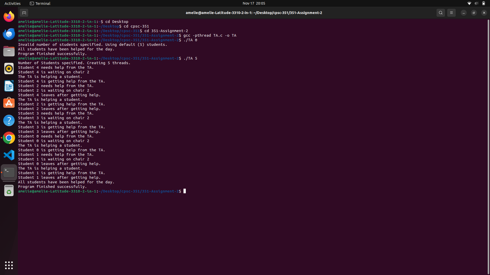

# 351-Assignment-2

# Group members:
- Amelie Gomez, 351-02, ameliegomez24@csu.fullerton.edu
- Robert Moberly, 351-02, rlmoberly91@csu.fullerton.edu
- Luke Makishima, 351-02, LukeMakishima@csu.fullerton.edu

# Group contributions:
- Amelie: Created diagram and worked on some of the code.
- Luke: Tested code and sat there.
- Robert: Helped with diagram and created skeleton code.

# Program Running Instructions:
- Linux environment 
- Open command prompt and navigate to the directory with the file TA.c
- Enter the command:
```
gcc -pthread TA.c -o TA
./TA <number of students>
```

# Programming Language Used:
- C++

# Screenshot of our Program:

